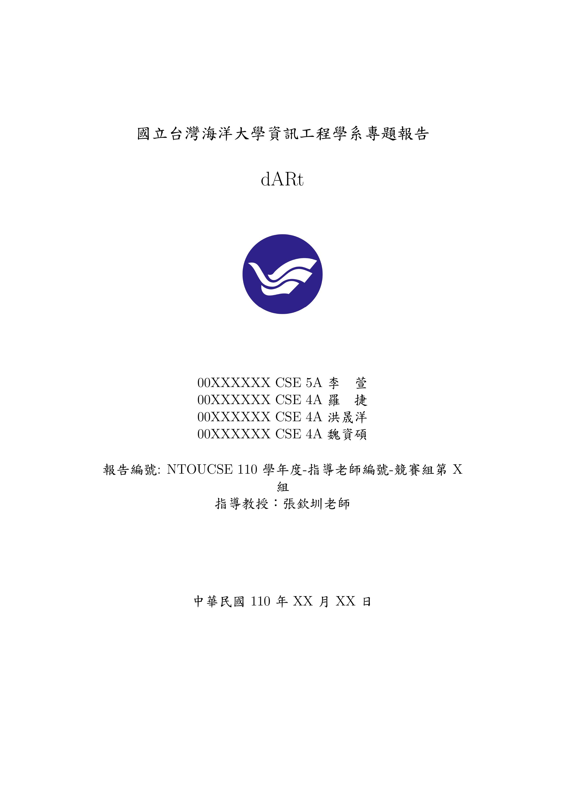
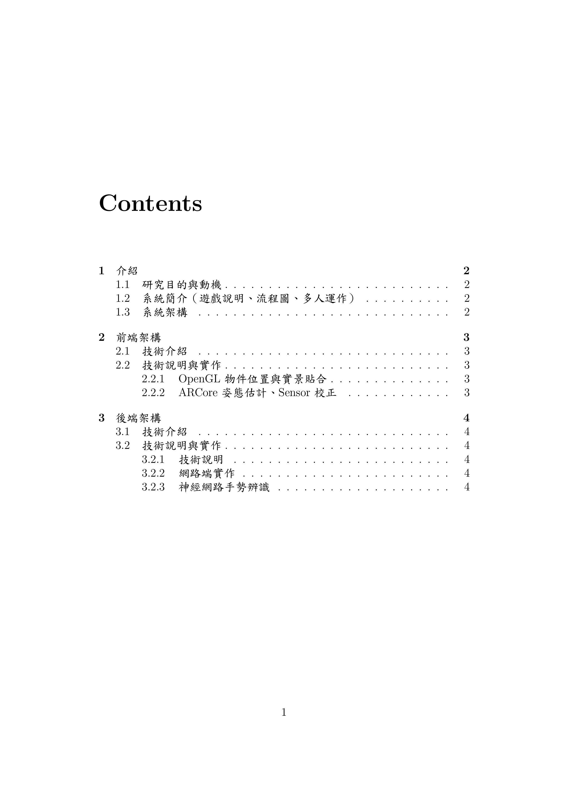
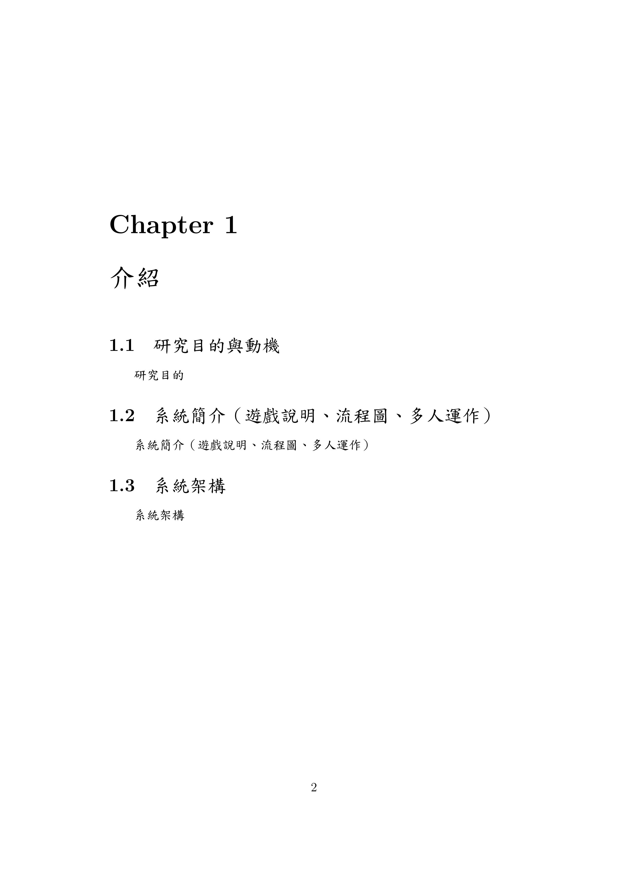
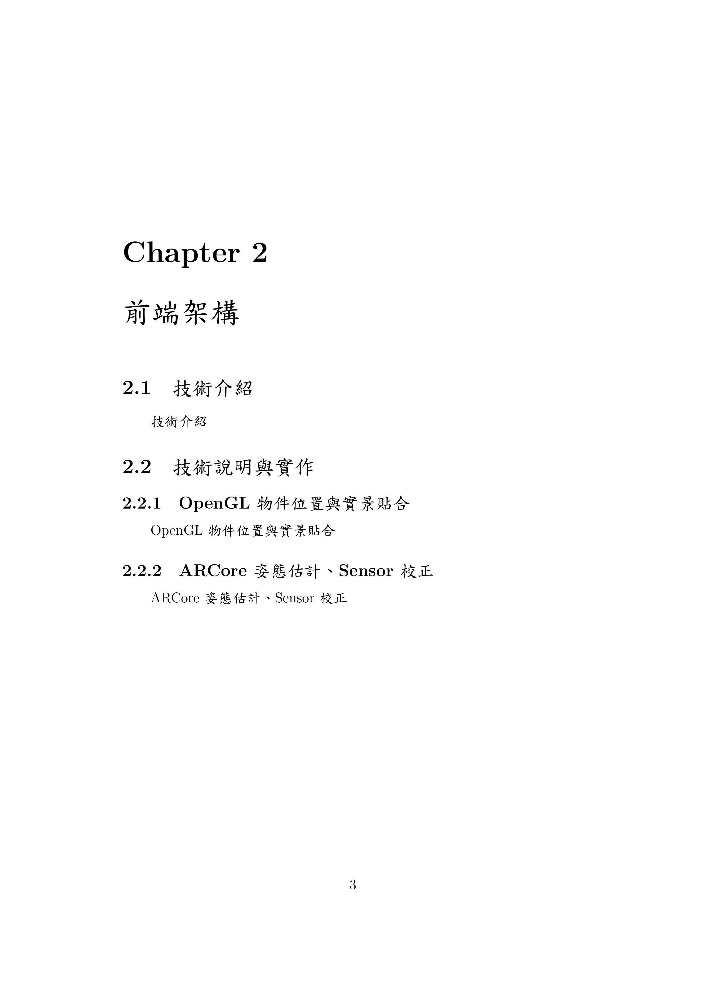
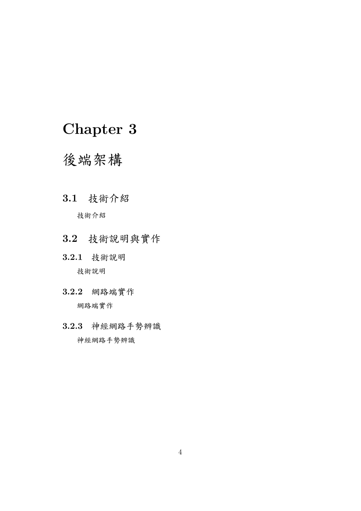

# dARt Report

主文件為 [Report.tex](./Report.tex)，為避免 Git 管理混亂，已經將各章分開成個別的檔案，分別為：

- [introduce](./introduce.tex)
- [frontend](./frontend.tex)
- [backend](./backend.tex)

圖片請放在 images 資料夾下（有需要請自己建立子資料夾），建議你各位除非需要引用其他 Package 或有其他特殊需求外不要修改主文件。

## LaTeX in VSCode Environment Setup Reference

[LaTeX Workshop – 在VSCode中編輯及編譯LaTeX](https://shaynechen.gitlab.io/vscode-latex/)

## PDF Preview

注意 TOC 需編譯二次才會正確顯示

